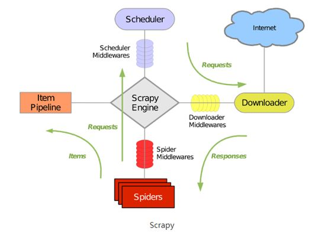

参考 Python3网络爬虫开发实战 崔庆才

## 爬虫基础
- HTTP基本原理
    - URI = URL $\cup$ URN
    - 超文本：HTML
    - HTTPS：HTTP+SSL
    - HTTP请求过程
        - 请求
            - 请求方法：Get、Post
            - 请求网址：URL
            - Request Header
                - Accept
                - Accept-Language
                - Accept-Encoding
                - Host $\checkmark$
                - Cookies
                - Referer
                - User-Agent
                - Content-Type
                    - Post
                      - application/x-www-form-urlencoded
                      - multipart/form-data
                      - application/json
                      - text/xml
            - Request Body
                - Post表单数据
        - 响应
            - Status Code：404
            - Response Header
                - Date
                - Last-Modified
                - Content-Encoding
                - Server
                - Content-Type
                - Set-Cookie
                - Expires
            - Response Body
                - HTML
                - Json
                - Binary
- 网页基础
    - 网页组成：HTML、CSS、JavaScript
    - 节点之间关系：DOM树
    - 选择器
        - 正则表达式
        - CSS选择器
        - Xpath
        - BeautifulSoup
        - pyquery
- 爬虫基本原理
    - 爬虫概述
        - 获取网页
        - 提取信息
        - 保存数据
        - 自动化程序
    - 动态网页：JavaScript渲染页面
- Session和Cookies
    - 无状态HTTP
    - Session：服务器
    - Cookies：客户端
        - Name
            - `Token`
        - Value
            - Unicoode字符:字符编码
            - Binary数据：BASE64编码
        - Domian
        - Max Age
        - Path
        - Size
        - HTTP字段: httponly(只能在HTTP头中)
        - Secure
- 代理的基本元素
    - 基本原理：proxy server
    - 代理的作用阿布云代理
    - 爬虫代理
    - 代理分类
        - 根据协阿布云代理
            - FTP代理服务器
            - HTTP代理服务器
            - SSL/TLS代理
            - RTSP代理
            - Telent代理
            - POP3/SMTP代理
            - SOCKS代理
        - 匿名程度区分
            - 高度匿名代理
            - 普通匿名代理
            - 透明代理
            - 间谍代理
    - 常见设置  
        - 免费代理
        - 付费代理
        - ADSL拨号

## 基本库的使用
- urllib：处理Cookies麻烦(需要Opener和Handler)
    - request
        - `urlopen()`
    - error
    - parse
    - robotparser
- requests
    - Get请求
        - 基本实例：`r = requests.get(url, headers=headers,params=params)`
        - 抓取网页：`r.text()` `r.json()`
        - 抓取二进制数据：`r.context()`
        - 响应：`r.status_code`, `r.cookies`, `r.history`
    - Post请求：`r = requests.post(url, data=data)`
    - 高级用法
        - 上传文件：`requests.post(url, files=files)`file类型为字典
        - Cookies：`key+'='+value`
        - 会话维持：`requests.Session()`
        - SSL证书验证：`requests.get(url, verify=False)`+`logging.captureWarnings(True)`
        - 代理设置：`requests.get(url, proxies=proxies)`
        - 超时设置：`timeout = 1`
        - 身份认证：`requests.get(url, auth=('username', 'passport'))`
        - Prepared Request：`s=Session()`+`req=Request()`+`pre=s.prepare_request(req)`+`r = s.send(prepped)`
- 正则表达式
    - 从字符串起始位置匹配：`result=re.match()`
        - 匹配目标：`result.group()`
        - 通用匹配：`'.*'`
        - 贪婪与非贪婪：`'.*?'`
        - 修饰符：`re.match(pattern, text, re.S)`包含换行符
        - 转移匹配：`r''`+`\.`
    - 扫描整个字符串：`re.search()`
    - 匹配所有内容：`re.findall()`
    - 修改文本：`re.sub('\d+', '', text)`
    - 正则表达式对象：`re.complie()`

## 解析库
- Xpath：
    - 基本实例
        - 读取文本：`html = etree.HTML(text)`+`result=etree.tostring(html)`(修正)+`result.decode('utf-8')`
        - 读取文件：`html = etree.parse('test.html', etree.HTMLParser())`     
    - 所有节点：`html.xpath('//*')`
    - 子节点：`/` vs `//`
    - 父节点：`..`
    - 属性匹配：`/div[@class="item"]`
    - 文本获取：`//text()`
    - 属性获取：`/@href`
    - 属性多值匹配：`/li[contains(@class, "li")]`
    - 多属性匹配：`/li[contains(@class, "li")] and @name="item"`
    - 按序选择(从1开始)：`//li[1]`
    - 节点轴选择：`//li[1]/child::*`

- BeautifulSoup
    - 基本实例：`soup = BeautifulSoup(text, "lxml")`+`soup.prettify()`
    - 选取节点：`soup.p`
- pyquery：`from pyquery import PyQuery as pq`
    - 基本实例：`doc=pq(html)` + `doc('li')`

## 数据存储
- 文件存储
    - TXT文本存储
        - 基本方法：`file = open('test.txt'，"w+")`+`file.write()`+`file.close()`
        - with语句：`with open('test.txt',"w+") as f: f.write()`                            
    - Json文件存储(数据串必须为双引号)
        - 读取：`data=json.loads(json)`+`data[0].get('age', 25)`
        - 输出：`json.dumps(data， indent = 2)`转化为字符串
    - CSV文件存储
        - 写入：`writer = csv.DictWriter(f, fieldnames=, delimiter=' ')`+`writer.writerow()`
        - 读取：`rows=csv.reader(f)`+`for row in rows:`

- 关系性数据库：
    - MySQL: `pymysql`
        - 操作流程
            - `db = pymysql.connect()`
            - `cursor = db.cursor()`
            - `cursor.execute()`
            - `data = cursor.fetchone()`
            - `db.commit()`
            - `db.close()`
    - 非关系型数据库存储
        - 键值存储：
            - Redis
              - 操作流程
                  - `redis = StrictRedis()`
                  - `redis.set()`
                  - `redis.get()`
              - RedisDump
                  - 导出数据：`redis-dump`
                  - 导入数据：`redis-load`
        - 文档型
            - MongoDB:`pymongo`
                - 操作流程
                    - `client = pymongo.MongoClient()`
                    - `db = client.test`
                    - `collection = db.students`
                    - `collection.insert_one()`
                    - `collection.find_one()`
## AJAX数据
- Ajax:异步的JavaScript和XML
    - 基本原理
        - 发送请求
        - 解析内容
        - 渲染网页
- Ajax分析方法
    - Network: XHR
        - Request Headers
            -  X-Requested-With:XMLHttpRequest
    - 结果提取

## 动态渲染页面爬取
- Selenium
    - 声明浏览器对象：`browser=webdriver.Chrome()`
    - 访问页面：`browser.get(url)`
    - 查找节点：`input=browser.find_element(s)(By.ID, 'q')`
    - 节点交互
        - 输入文字：`input.send_keys()`
        - 清空文字：`input.clear()`
        - 点击按钮：`input.click()`
    - 动作链(拖拽)
        - 查找拖拽节点和目标节点：`source` + `target`
        - 声明：`actions = ActionChains(browser)`
        - 方法：`actions.drag_and_drop(source, target)`
        - 执行：`actions.perform()`
    - 执行JavaScript：`broswer.execute_script('alert()')`
    - 获取节点信息
        - 获取属性：`input.get_attribute('class')`
        - 获取文本值：`input.text`
        - 获取id、位置、标签名和大小：`id`+`location`+`tag_name`+`size`
    - 切换Frame：`browser.switch_to.frame('iframeResult')`
    - 延时等待
        - 隐式等待：`browser.implicity_wait(10)`
        - 显式等待：`wait = WebDriverWait(browser, 10)`+`input = wait.until(EC.presence_of_element_located((By.ID,'q')))`
    - 前进和后退：`broswer.back()`+`broswer.forword()`
    - Cookies: `broswer.get_cookies()`
    - 选项卡管理：`broswer.switch_to_window()`
    - 异常处理：`try` +`except`
- Splash：异步
    - Lua 脚本：`splash:go(url)`
    - 异步：`splash:wait(0.5)`
    - 禁止图片加载：`images_enabled = false`
    - API调用
        - HTML:`render.html`
        - 图片：`render.png`
        - Json: `render.json`
        - 对接Lua脚本:`execute`
    - 负载均衡配置：分散到各个服务器上
        - 配置Splash服务
        - 配置负载均衡：Nginx
        - 配置认证
        - 测试
## 验证码
- 图形验证码的识别
    - tesserocr:`tesserocr.file_to_text('filename')`
        - PIL: `image = PIL.Image.open('filename')` + `tesserocr.image_to_text(image)`
        - 验证码处理：`image.convert('L')`+`threshold table`+`image.point(table,'1')`
- 极验滑动验证码的识别
    - 特点
        - 防模拟
        - 防伪造
        - 防爆力
    - 识别思路
        - 模拟点击眼中按钮：Selenium
        - 识别滑动缺口的位置：原图对比，边缘检测
        - 模拟拖动滑动：随机抖动，先加速后减速
- 点触验证码识别：验证码服务平台
    - 识别文字
    - 图像识别
- 微博宫格验证码的识别
    - 模板匹配

## 代理和cookie
- 代理
    - 代理的设置:`proxy = 'IP:port'`
        - urllib
            - http:`ProxyHandler({'http': 'http://'+proxy,})`
            - socks:`socks.set_default_proxy(socks.SOCKS5, 'IP', port)`
        - requests:`proxies=proxies`
            - http:`proxies={'http': 'http://'+proxy,}`
            - socks:`proxies={'http': 'socks5://'+proxy,}`
        - Selenium:
            - Chrome:`options.add_argument('--proxy-server=http://'+proxy)`
            - PhantomJS:`service_args=['--proxy=IP:port','--proxy-type=http' ]`
    - 代理池的维护
        - 存储模块：Redis Sorted Set
            - 代理的去重和状态标识
        - 获取模块：定时从代理网站获取代理
            - `Metaclass`
        - 检测模块：定时从数据库获取代理，并对其检测
            - 可用设为100：只要可用都可以被获取到
            - 不可用减1：代理拯救回来的机会更多
            - 新获取设为10：免费网站无效比例高
        - 接口模块Web API：接口通过连接数据库并通过Web形式返回可用代理
    - ADSL拨号代理：每次拨号就换一个IP

- Cookie池
    - 存储模块：Redis Hash
        - `accounts`：`username:password`
        - `cookies`：`username:cookies`
    - 生成模块
        - 找到没有生成Cookies的帐号
        - 登录逐个生成Cookies
    - 检测模块
        - 检测Cookies失效
        - 数据库中移除
    - 接口模块

## App的爬取
- 设置代理
    - 抓包软件: 
        - `Charles`
        - `mitmproxy`
            - `mitmdump`
            - `mitmweb`
    - 自动化：`Appium`

## 框架
- 框架的形成：只需关注核心逻辑
    - 不同功能定义不同的方法
    - 抽象出模块的概念
    - 调度器、队列、异常处理、请求对象
    - 各个组件独立
- Pyspider:快速实现页面抓取
    - 组成
        - Scheduler
        - Fetcher
        - Processor
        - monitor&Web UI
    - 用法
        - 命令行：`pyspider all`
        - 请求生成：`crawl()`
        - 任务区分：URL的MD5值
        - 全局配置：`crawl_config`
        - 定时爬取：`@every(minutes=24*60)`
        - 项目状态：`RUNNING`
        - 抓取进度：progress
        - 删除项目：`STOP` + `delete`
- Scrapy：反爬程度强、超大规模的抓取，基于Twisted的异步处理框架 
    - 组成
        - Engine
        - Item
        - Scheduler
        - Downloader
        - Spiders
        - Item Pipeline
        - Downloader Middlewares
        - Spider Middlewares
    - 项目结构
        - `scrapy.cfg`
        - `items.py`
        - `pipelines.py`
        - `settings.py`
        - `middlewares.py`
        - `spiders`
    - Selector的用法
        - Scrapy shell: `scrapy shell url`
        - xpath选择器：
            - xpath: `response.xpath()`
                - 方法：`extract()`+`extract_first()`
            - css: `response.css()`
                - 文本和属性：`::text` + `::sttr()`
            - 正则匹配：`response.xpath().re()`
                - 方法：`re_first()`
    - Spider的用法：`Request(url, callback)`
        - 运行流程
            - 定义爬取动作
            - 分析网页
        - Spider类：`scrapy.spiders.Spider`
            - 基础属性
                - 名称：`name`
                - 起始URL列表：`start_urls`
                - 本Spider配置：`custom_settings`
                - 全局设置变量：`settings`
            - 常用方法
                - 生成初始请求：`start_requests()`
                - 默认处理：`parse()`
    - Downloader Middleware: 在Request和Response之间
        - 变量(字典)：`DOWNLOADER_MIDDLEWARES_BASE={name: score}`
        - 核心方法
            - `process_request(request, spider)`
            - `process_response(request, response, spider)`
            - `process_exception(request, exception, spider)`
    - Spider Middleware: Downloader、Spider、Item Pipsline
        - 变量(字典)：`SPIDER_MIDDLEWARES_BASE={name: score}`
        - 核心方法
            - `process_spider_input(response, spider)`
            - `process_spider_output(response, result, spider)`
            - `process_spider_exception(response, exception, spider)`
            - `process_start_requests(start_requests, spider)`
    - Item Pipeline：数据清洗、存储
        - 核心方法：
            - 必须：`process_item(item, spider)`
            - 得到全局配置：`from_crawler(cls, crawler)`
    - 渲染
        - Selenium
            - `Download Middlerware`
            - `process_request()`
            - `HtmlResponse()`
        - Splash：支持异步
            - 添加配置：`Scrapy-Splash`
            - Spidr: `SplashRequest()`
    - 通用爬虫：将Spider的公共部分保留，不同提取为单独配置
        - Spider子类：`CrawlSpider`
            - 方法：`parse_start_url()`
            - 属性：`rules`
        - Item Loader: Item的提取规则
    - HTTP接口：Scrapyrt
    - Docker:环境配置

## 分布式爬虫
- 原理
    - 架构
        - 爬取队列
        - 调度器
    - 维护爬取队列：redis
    - 去重
        - Request的hash值
        - Bloom Filter对接：概率算法
    - 防止中断：保存在本地无需担心
    - 实现：`Scrapy-Redis`
- 部署
    - Scrapyd分布式部署：服务器
        - 流程
            - 本地打包Egg文件
            - 部署到远程Scrapyd
        - Scrapyd-Client:`scrapyd-deploy`
        - Gerapy：图形界面
    - 对接Docker
        - 批量部署
            - 镜像部署
            - 模板部署